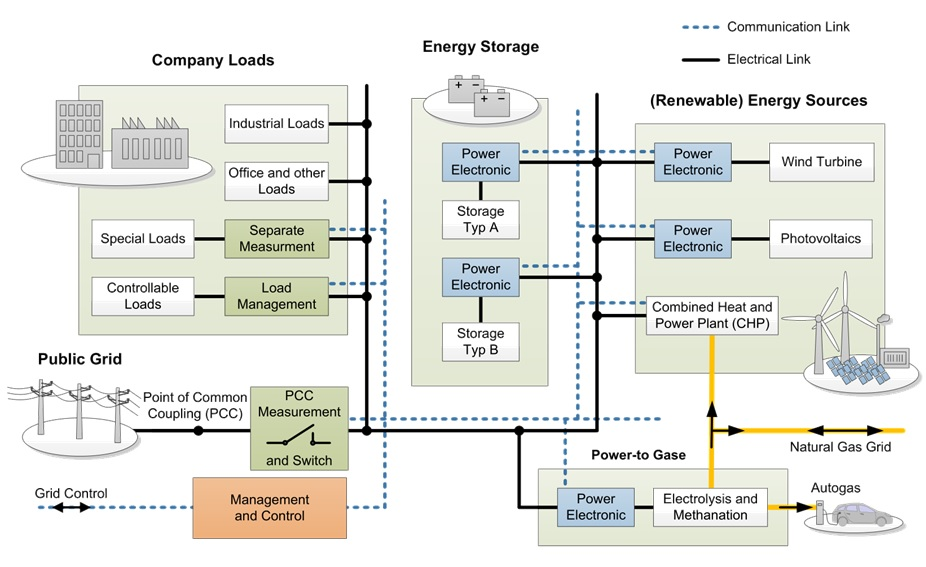
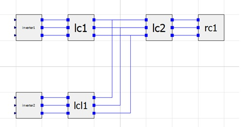
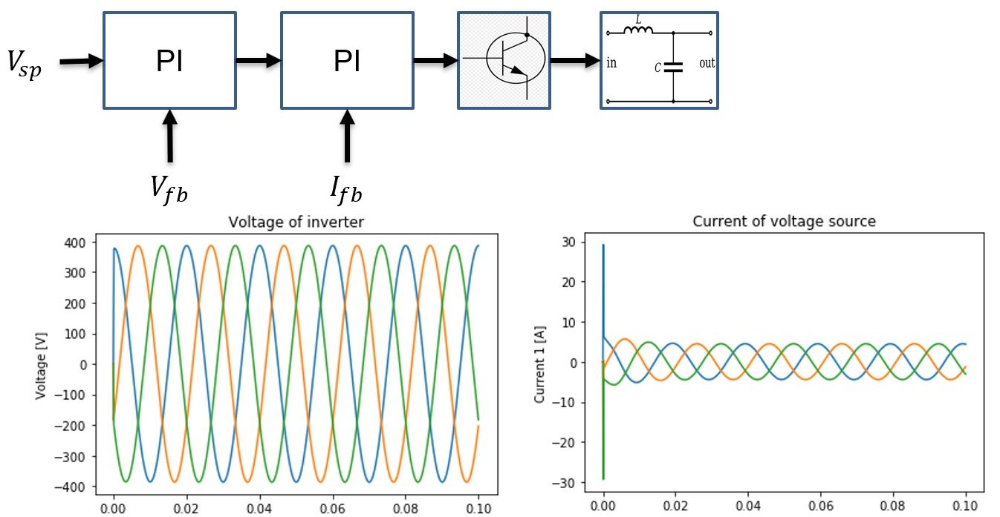
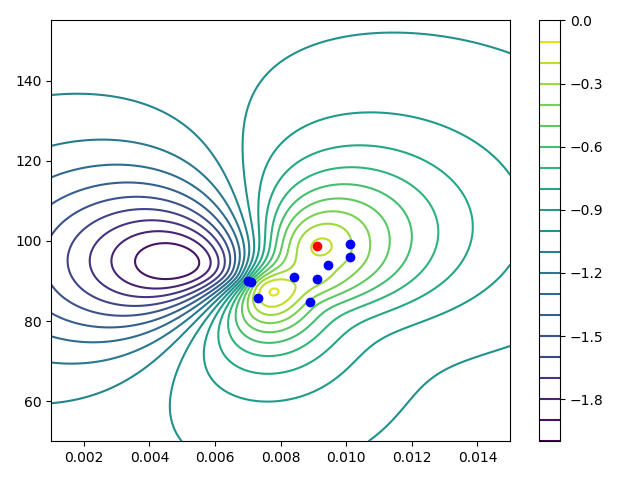

# OpenModelica Microgrid Gym (OMG)



__The OpenModelica Microgrid Gym (OMG) package is a software toolbox for the
simulation and optimisation of Microgrids.__ 

The main characteristics of the toolbox are the plug-and-play grid design in OpenModelica and the ready-to-go approach of simply Reinfrocement Learning (RL) agents. 

The is built upon the [OpenAI Gym Environments](https://gym.openai.com/) for reinforcement learning. 
Therefore, the toolbox is specifically designed for running reinforcement 
learning algorithms to train agents controlling the Microgrids.

 A more detailled description of the project is presented in the [User Guide](/user_guide/user_guide.html)

## Installation

#### Install Python environment
- Install OpenModelica MicrogridGym from PyPI (recommended):

```
pip install openmodelica_microgrid_gym
```

- Or install from Github source:

```
git clone TODO: XXXXXXXXXXXXXXXXXXXXXXXXXXXXXX 
cd openmodelica_microgrid_gym
# Then either
python setup.py install
# or alternatively
pip install -e .
```

**Hint:** If you are running a windows, PyFMI might throw some errors while installing via pip.
It can be installed via _conda_ by running:

    conda install -c conda-forge pyfmi 


#### Installation of OpenModelica

OMG was create by using [OMEdit](https://openmodelica.org/download/download-windows) v1.16

Using a Linux, sometimes appear some problems by trying to install OpenModelica. In this case, try to download the pre-built [virtual machine](https://openmodelica.org/download/virtual-machine). 


## Getting started


OMG uses the [FMI standard](https://fmi-standard.org/) for the exchange of the model between OpenModelica and python.

An example network consisting out of two inverters, three filters and an inductive load.



You can either use one of the provided FMUs (Windows and Linux, 64-bit, both included in the grid.network.fmu) or create your own by running: 


```
path\reinforcement_learning_microgrid\reinforcement_learning_microgrid\fmu> omc create_fmu.mos
```
Running the staticctrl.py starts a simulation with a manually tuned cascaded PIPI controller



A save bayseian approach of a Reinforcement Learning agent is provided under examples/berkamkamp.py.



Every user defined settings can be directly done in the example program. 

* `env = gem.make(environment-id, **kwargs)`  
    Returns an instantiated grid environment. Provide any additional settings right here (see full documentation for all possibilities)

 

### Running Tests with Pytest
To run the tests ''pytest'' is required.
All tests can be found in the ''tests'' folder.
Execute pytest in the project's root folder:
```
>>> pytest
```
or with test coverage:
```
>>> pytest --cov=./
```
All tests shall pass.

### Citation
A whitepaper for this framework will be avaiable soon. Please use the following BibTeX entry for citing us:
```
@misc{LEA2020XXXXXXX,
    title={XXXXXXXXXX},
    author={Daniel Weber and Stefan Heid and Henrik Bode and Oliver Wallscheid},
    year={2020},
    eprint={XXXXX},
    archivePrefix={arXiv},
    primaryClass={eess.SY}
}
```