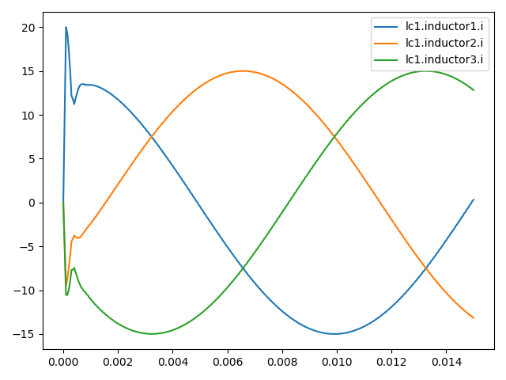
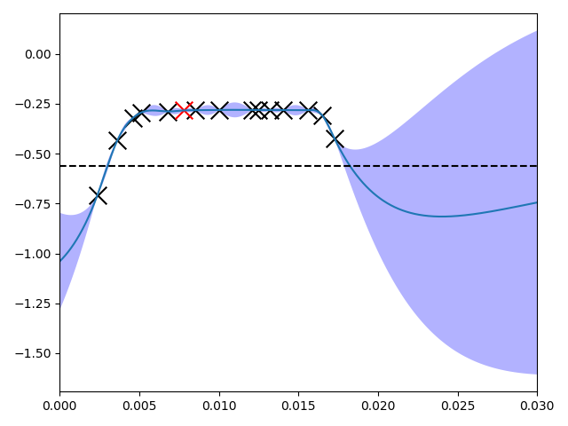
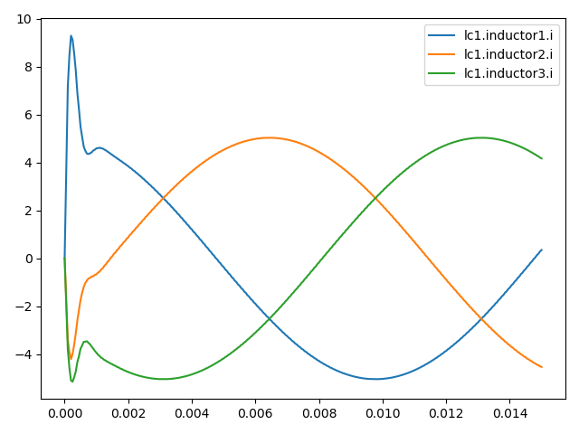

#  Examples

####staticctrl.py

The example staticctrl.py is the default function to check a scpecific set of control parameters and if the simulation is running.
In the default setings, plots of the abc signal as well as the dq0 signals of the master and slave are provided.

By default, the following small network will be simulated:

A short introduction to experimental controller tuning with some hints can be found [here](controller_tuning.html).

If the controller works fine, a three phase voltage similar to the following one should be one of the plots. 

 
Any other demanded signal which is provided by the fmu or saved during the simulating can be plotted by adding it to 

    viz_cols=['*.m[dq0]', 'slave.freq', 'lcl1.*'],
 
in the gym.make() command. Make sure that demanded signal from the fmu are listed as a model_output:

    model_output={
                       'lc1': [
                           ['inductor1.i', 'inductor2.i', 'inductor3.i'],
                           ['capacitor1.v', 'capacitor2.v', 'capacitor3.v']],
                       'rl1': [f'inductor{i}.i' for i in range(1, 4)],
                       'lcl1':
                           [['inductor1.i', 'inductor2.i', 'inductor3.i'],
                            ['capacitor1.v', 'capacitor2.v', 'capacitor3.v']]},
                       )

Hint: Every possible variable which is provided by the fmu can be seen the easiest in OpenModelica. Run the Simulation without input signals, so every  result should be 0.
On the bottom right side, you can select each component of the model in the tree structure. 
Clicking through the components until reaching the variable will show the whole variable name (for example lcl2.inductor2.i) on top of the plotting window.

The parameters of the controller like the control frequency delta_t, the voltage, frequency or droop characteristics can be set directly in the main function. 
 
 
####single_inverter_current_control_safe_opt.py

In this example a three phase inverter is supplying via a filter (lc1) a load (rl1) like shown in the 
figure below.
From that model a FMU is built to create the environment.

An optimization methode developed by Berkenkamp et al. (https://arxiv.org/abs/1509.01066) called Safe
Controller Optimization - safeopt - is used which takes a Gaussian process and Bayesian optimization to safely determine 
"optimal" controller parameters. 
The goal of the standard PI current controller is to supply a 15 A d-current to the load. 

The [generated FMU](fmu.html) is used in the environment to build up a gym env like the examples from OpenAI Gym 
(https://gym.openai.com/). 
The gym enviroment is defined in (examples/berkenkamp.py, line 103).
It generates a gym environment using 
 - reward function (line 51)
 - Plotting the inductor values (current) from the lc1-filter (which should be controlled) like shown in the figure below
 - Simulating 300 timesteps of delta_t of the FMU grid.network_singleInverter.fmu (Generated from the model in the plot abouve)
 - Using the setpoints for the inverters (modulation indices) i1p{1,2,3} as inputs
 - and the inductor currents and capactitor voltages of lc1-filter as ouptuts
 

The agent used in this simple RL-example is taken from the class __SafeOptAgent__.
It contains the controller a __MultiPhaseDQCurrentSourcingController__, which consists of multiphase (3) PI controllers 
to controll the current across the inductor of the lc1-filter. 
There are also droop controllers implemented to calculate e.g. the frequency drop due to load.
The agent's task is to find better parameters for the current controllers (Kp & Ki). 
Therefore they are defined as mutable_params (e.g. examples/single_inverter_current_control_safe_opt.py, line 126) to 
adopt them between the episodes.
The safeopt algorithm uses a Gaussian process to estimate the performance of the controller. 
Therefore the bounds (e.g. examples/single_inverter_current_control_safe_opt.py, line 97) and the 
lengthscale (eg. examples/single_inverter_current_control_safe_opt.py, line 98) for the 
parameters (Kp and Ki) have to be defined.  

One can adjust one of the parameters (Kp or Ki) (1D) or both of them (2D) using the algorithm.
Therefore the parameters in line 28-30 have to be adjusted:
- To adjust only Kp set __adjust_Kp_only__ == True (and all other parametes as False!)
- To adjust only Ki set __adjust_Ki_only__ == True (and all other parametes as False!)
- To adjust only Kp and Ki set __adjust_Kp_and_Ki__ == True (and all other parametes as False!)

Due to safeopt the agent need a safe starting point (Kp and Ki). Then it tries to calculate safely parameters with 
better performance.
The performance is calculated using the reward function from the enviroment defined in the function 
(examples/single_inverter_current_control_safe_opt.py, line 51). 
There the MSE from the measured currents and the setpoints are calculated. 
Additionally a barrier function is used to avoid over-currents. 
The function can be adjusted using the parameter mu in (examples/single_inverter_current_control_safe_opt.py, line 44).
In case of an over-current the episode is aborted and a performance of the abort_reward-times (line 144) initial reward 
(negative) is given back. 
The safe threshold for the agent is set as safe_threshold-times less of the inital performance. (agents/safeopt.py, line 85)
E.g. safe_threshold = 1.2 and the inital reward is -10 the safe threshold would be -12.

In the end of the script a __Runner__ is used to execute 10 episodes using the agent to control the enviroment. 
For every episode the controlled currents and the performance function as a function of Kp and/or Ki are plotted.

Some exemplary results are shown below:

- If the parameter __adjust_Kp_only__ is True, the agent tries to find an optimal value for the proportional gain (Kp)
 of the controller in the range of [0, 0.03] (bounds, line 87) with a lengthscale of 0.01 (line 88).
 In the figure below on the x-axis is the value for Kp and on the y-axis the performance value calculated using the 
 reward function mentioned above. 

 

- If the parameter __adjust_Ki_only__ is True, the agent tries to find an optimal value for the integral gain (Ki)
 of the controller in the range of [0, 300] (bounds, line 92) with a lengthscale of 50 (line 93).
 In the figure below on the x-axis is the value for Ki and on the y-axis the performance value calculated using the 
 reward function mentioned above. 

 

 The - due to the algorithm - "unsafe" point on the right (for Kp as well as for Ki) is not due to overcurrent but due 
 to bad performance due to  permanent control error.
 The resulting currents for Kp = 0.01 and Ki = 0 is shown in the picture below.
 Due to the high error compared to the reference value (15 A d-current), the performance is as bad as the algorithm 
 deifnes it as unsafe - in comparison to the performance reached using the intial controller parameters. 
 
 
  

 - If the parameter __adjust_Kp_and_Ki__ is True, the agent tries to find an optimal value for the propotional gain (Kp)
  as well as for the integral gain (Ki) of the controller in the ranges of [0, 0.03] and a lengthscale of 0.01 for Kp 
  and a range of [0, 300] and a lengthscale of 50 for Ki.
 In the figure below on the x-axis is the value for Kp, the y-axis the value for Ki and the z-axis the performance value
  calculated using the reward function. 

The results of the algorithm are printed into the console in the form like below:

Iteration, performance J, Params [Kp, Ki]

           J                                      Params
    0  -0.527522                                [0.01, 10.0]
    1  -0.442648    [0.01517286546392185, 14.85163114970222]
    2  -0.318154    [0.01426989823624961, 44.96747682456248]
    3  -0.296940   [0.007935547159879385, 63.12800825929393]
    4  -0.286636    [0.01482713453607815, 88.70170996759624]
    5  -0.286815  [0.006770598304777539, 108.12303673537075]
    6  -0.280167  [0.013261084415467694, 135.24448051372738]
    7  -0.313204   [0.02201710533671064, 56.446583269542394]
    8  -1.387003  [0.022868977920736434, 108.40140778199653]
    9  -0.304403   [0.002145673177669012, 55.14569829606201]
    10 -0.480421   [0.026197353734745858, 22.29566509028389]
    11 -1.097157  [0.0055262530542335535, 157.4879776902759]
    12 -0.391706                    [0.0, 17.86728037560901]
    13 -1.307038                    [0.0, 106.0724160092763]
    14 -1.561142                    [0.03, 42.1020413015999]
    
The best performance in this short example of -0.280167 produces the parameterset of Kp = 0.0132... 
and Ki = 135.244...