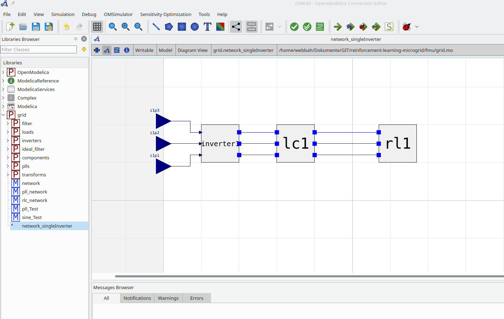
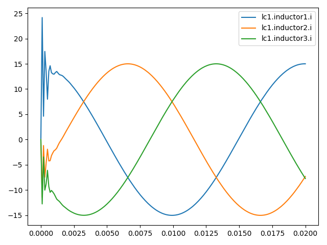

#  Examples

####staticctrl.py

The example staticctrl.py is the default function to check a scpecific set of control parameters and if the simulation is running.
In the default setings, plots of the abc signal as well as the dq0 signals of the master and slave are provided.

By default, the following small network will be simulated:

A short introduction to experimental controller tuning with some hints can be found [here](controller_tuning.html).

If the controller works fine, a three phase voltage similar to the following one should be one of the plots. 

 
Any other demanded signal which is provided by the fmu or saved during the simulating can be plotted by adding it to 

    viz_cols=['*.m[dq0]', 'slave.freq', 'lcl1.*'],
 
in the gym.make() command. Make sure that demanded signal from the fmu are listed as a model_output:

    model_output={
                       'lc1': [
                           ['inductor1.i', 'inductor2.i', 'inductor3.i'],
                           ['capacitor1.v', 'capacitor2.v', 'capacitor3.v']],
                       'rl1': [f'inductor{i}.i' for i in range(1, 4)],
                       'lcl1':
                           [['inductor1.i', 'inductor2.i', 'inductor3.i'],
                            ['capacitor1.v', 'capacitor2.v', 'capacitor3.v']]},
                       )

Hint: Every possible variable which is provided by the fmu can be seen the easiest in OpenModelica. Run the Simulation without input signals, so every  result should be 0.
On the bottom right side, you can select each component of the model in the tree structure. 
Clicking through the components until reaching the variable will show the whole variable name (for example lcl2.inductor2.i) on top of the plotting window.

The parameters of the controller like the control frequency delta_t, the voltage, frequency or droop characteristics can be set directly in the main function. 
 
 
####Berkenkamp.py

This example uses an optimization methode developed by Berkenkamp et al. (https://arxiv.org/abs/1509.01066) called Safe
Controller Optimization - safeopt - which is using a Gaussian process and Bayesian optimization to safely determine 
"optimal" controller parameters. 
The application is an three phase inverter connected via filters (lc1 and lc2) to a load (rl1) and is shown in the 
figure below.

The [generated FMU](fmu.html) is used in the environment to build up a gym env like the examples from OpenAI Gym 
(https://gym.openai.com/). 
The gym enviroment is defined in (examples/berkenkamp.py, line 103).
It generates a gym environment using 
 - reward function (line 34)
 - Plotting the inductor values (current) from the lc1-filter (which should be controlled) like shown in the figure below
 - Simulating 200 timesteps of delta_t
 - Of the FMU grid.network_singleInverter.fmu (Generated from the model in the plot abouve)
 - Using the setpoints for the inverters (modulation indices) i1p{1,2,3} as inputs
 - and the inductor currents and capactitor voltages of lc1-filter as ouptuts
 

The agent used in this simple RL-example is taken from the class __SafeOptAgent__.
It contains the controller a __MultiPhaseDQCurrentSourcingController__, which consists of multiphase (3) PI controllers 
to controll the current across the inductor of the lc1-filter. 
There are also droop controllers implemented to calculate e.g. the frequency drop due to load.
The agent's task is to find better parameters for the current controllers (Kp & Ki). 
Therefore they are defined as mutable_params (examples/berkenkamp.py, line 79) to adopt them between the episodes.
The safeopt algorithm uses a Gaussian process to estimate the performance of the controller. 
Therefore the bounds (examples/berkenkamp.py, line 65) and the lengthscale (examples/berkenkamp.py, line 69) for the 
parameters (Kp and Ki) have to be defined.  
If only one parameter should be adopted the dimension has to be reduced here and the mutable_params have to be changed. 
Due to safeopt the agent need a safe starting point (Kp and Ki). Then it tries to calculate safely parameters with 
better performance.
The performance is calculated using the reward function from the enviroment defined in the function 
(examples/berkenkamp.py, line 34). 
There the MSE from the measured currents and the setpoints are calculated. 
Additionally a barrier function is used to avoid over-currents. 
The function can be adjusted using the parameter mu in (examples/berkenkamp.py, line 28)
In case of an over-current the episode is aborted and a performance of the doubled initial reward (negative) is given 
back. 
The safe threshold for the agent is set as 20 % less of the inital performance. (agents/safeopt.py, line 85)

In the end of the script a __Runner__ is used to execute 10 episodes using the agent to control the enviroment. 
For every episode the controlled currents and the performance function as a function of Kp and Ki are plotted.
In the figure below this performance function (z-axis) is shown after 10 episodes. (x-axis: Kp, y-axis: Ki).

The results of the algorithm are printed into the console 