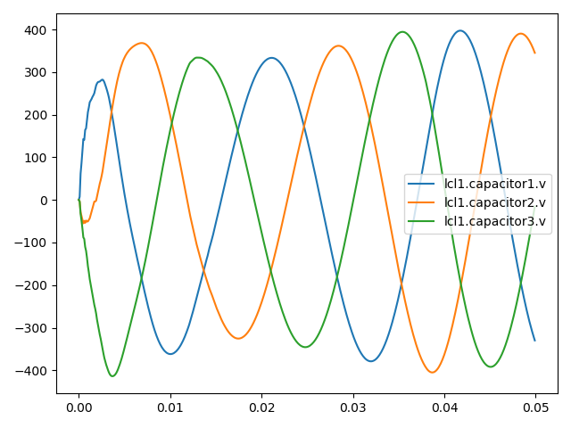

#  Examples

###staticctrl.py

The example staticctrl.py is the default function to check a scpecific set of control parameters and if your simulation is running.
In the default setings, plots of the abc signal as well as the dq0 signals of the master and slave are provided.

If the controller works fine, a three phase voltage similar to the following one should be one of the plots. 

 
Any other demanded signal which is provided by the fmu or saved during the simulating can be plotted by adding it to 

    viz_cols=['*.m[dq0]', 'slave.freq', 'lcl1.*'],
 
in the gym.make() command. Make sure that demanded signal from the fmu are listed as a model_output:

    model_output={
                       'lc1': [
                           ['inductor1.i', 'inductor2.i', 'inductor3.i'],
                           ['capacitor1.v', 'capacitor2.v', 'capacitor3.v']],
                       'rl1': [f'inductor{i}.i' for i in range(1, 4)],
                       'lcl1':
                           [['inductor1.i', 'inductor2.i', 'inductor3.i'],
                            ['capacitor1.v', 'capacitor2.v', 'capacitor3.v']]},
                       )

Hint: Every possible variable which is provided by the fmu can be seen the easiest in OpenModelica. Run the Simulation without input signals, so every  result should be 0.
On the bottom right side, you can select each component of the model in the tree structure. 
Clicking through the components until reaching the variable will show the whole variable name (for example lcl2.inductor2.i) on top of the plotting window.

The parameters of the controller like the control frequency delta_t, the voltage, frequency or droop characteristics can be set directly in the main function. 
 
 
#Berkenkamp.py

 